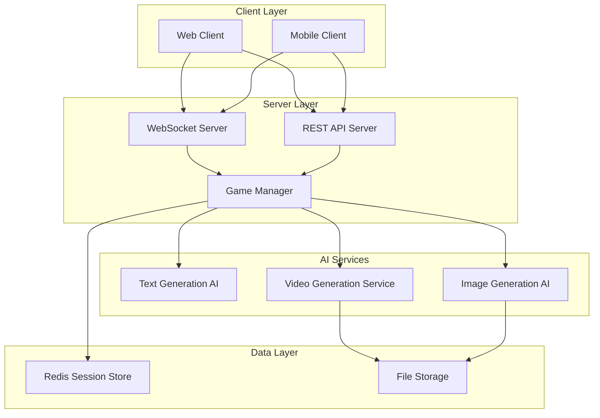

# Design Document

## Overview

The AI Mad Libs Party Game is a real-time multiplayer web application that creates an interactive party game experience similar to Jackbox games. The system combines AI-powered story generation, image creation, and video production to deliver a rich multimedia experience where players collaborate to create humorous stories.

The application follows a client-server architecture with real-time communication, AI service integration, and multimedia processing capabilities. Players join game rooms, contribute words in turns, and experience the final story through AI-generated visuals and video presentation.

## Architecture

### High-Level Architecture



### Technology Stack

**Frontend:**
- React/Next.js for web client
- Socket.io-client for real-time communication
- Canvas API for video preview
- Web Share API for sharing functionality

**Backend:**
- Node.js with Express
- Socket.io for WebSocket management
- Redis for session storage and game state
- Multer for file handling

**AI Services:**
- Amazon Bedrock with Nova Lite for story template generation
- Amazon Bedrock with Nova image models for image generation
- AWS Elemental MediaConvert for video creation and processing

**Infrastructure:**
- Amazon S3 for media file storage
- Amazon CloudFront CDN for fast media delivery
- AWS Application Load Balancer for scaling WebSocket connections
- Amazon ElastiCache (Redis) for session storage

## Components and Interfaces

### Core Components

#### 1. Game Manager
**Responsibility:** Orchestrates game sessions, player management, and game state transitions

```typescript
interface GameManager {
  createGame(hostId: string): Promise<GameSession>
  joinGame(roomCode: string, playerId: string, username: string): Promise<void>
  startWordCollection(gameId: string): Promise<void>
  submitWord(gameId: string, playerId: string, word: string): Promise<void>
  generateStory(gameId: string): Promise<Story>
  createVideo(gameId: string): Promise<VideoResult>
}
```

#### 2. AI Story Generator
**Responsibility:** Creates original Mad Libs templates and processes completed stories

```typescript
interface StoryGenerator {
  generateTemplate(theme?: string, playerCount: number): Promise<StoryTemplate>
  fillTemplate(template: StoryTemplate, words: WordSubmission[]): Promise<Story>
  validateTemplate(template: StoryTemplate): boolean
}
```

#### 3. Image Generator
**Responsibility:** Creates AI images for story paragraphs

```typescript
interface ImageGenerator {
  generateImage(prompt: string, style: ImageStyle): Promise<ImageResult>
  generateBatch(prompts: string[]): Promise<ImageResult[]>
  optimizeForVideo(image: ImageResult): Promise<ImageResult>
}
```

#### 4. Video Creator
**Responsibility:** Combines story, images, and player credits into video

```typescript
interface VideoCreator {
  createStoryVideo(story: Story, images: ImageResult[], players: Player[]): Promise<VideoResult>
  addTransitions(scenes: VideoScene[]): Promise<VideoResult>
  exportVideo(video: VideoResult, format: VideoFormat): Promise<string>
}
```

#### 5. Real-time Communication Handler
**Responsibility:** Manages WebSocket connections and real-time events

```typescript
interface RealtimeHandler {
  broadcastToRoom(roomCode: string, event: GameEvent): void
  notifyPlayer(playerId: string, event: GameEvent): void
  handlePlayerDisconnect(playerId: string): void
  syncGameState(roomCode: string): void
}
```

## Data Models

### Game Session
```typescript
interface GameSession {
  id: string
  roomCode: string
  hostId: string
  players: Player[]
  gameState: GameState
  storyTemplate: StoryTemplate | null
  wordSubmissions: WordSubmission[]
  completedStory: Story | null
  createdAt: Date
  updatedAt: Date
}

enum GameState {
  WAITING_FOR_PLAYERS = 'waiting_for_players',
  COLLECTING_WORDS = 'collecting_words',
  GENERATING_STORY = 'generating_story',
  DISPLAYING_STORY = 'displaying_story',
  CREATING_VIDEO = 'creating_video',
  COMPLETED = 'completed'
}
```

### Player
```typescript
interface Player {
  id: string
  username: string
  isHost: boolean
  isConnected: boolean
  wordsContributed: number
  joinedAt: Date
}
```

### Story Template
```typescript
interface StoryTemplate {
  id: string
  title: string
  paragraphs: Paragraph[]
  totalWordBlanks: number
  theme: string
  difficulty: 'easy' | 'medium' | 'hard'
}

interface Paragraph {
  id: string
  text: string
  wordBlanks: WordBlank[]
  imagePrompt: string
}

interface WordBlank {
  id: string
  type: WordType
  position: number
  assignedPlayerId: string | null
}

enum WordType {
  NOUN = 'noun',
  VERB = 'verb',
  ADJECTIVE = 'adjective',
  ADVERB = 'adverb',
  PLURAL_NOUN = 'plural_noun',
  PAST_TENSE_VERB = 'past_tense_verb',
  COLOR = 'color',
  NUMBER = 'number',
  PLACE = 'place',
  PERSON = 'person'
}
```

### Word Submission
```typescript
interface WordSubmission {
  id: string
  wordBlankId: string
  playerId: string
  playerUsername: string
  word: string
  wordType: WordType
  submittedAt: Date
}
```

### Story and Media
```typescript
interface Story {
  id: string
  title: string
  paragraphs: CompletedParagraph[]
  playerContributions: PlayerContribution[]
  createdAt: Date
}

interface CompletedParagraph {
  id: string
  text: string
  imageUrl: string | null
  wordHighlights: WordHighlight[]
}

interface WordHighlight {
  word: string
  playerUsername: string
  startIndex: number
  endIndex: number
}

interface VideoResult {
  id: string
  url: string
  thumbnailUrl: string
  duration: number
  format: VideoFormat
  size: number
  createdAt: Date
}
```

## Error Handling

### AI Service Failures
- **Story Generation Failure:** Fall back to pre-defined templates stored in database
- **Image Generation Failure:** Use placeholder images or text-only presentation
- **Video Creation Failure:** Offer alternative sharing formats (images, text)

### Network and Connection Issues
- **Player Disconnection:** Maintain game state for 5 minutes, allow reconnection
- **Host Disconnection:** Transfer host privileges to longest-connected player
- **Server Disconnection:** Implement client-side reconnection with exponential backoff

### Validation and Security
- **Input Validation:** Sanitize all user inputs, limit word length to 50 characters
- **Rate Limiting:** Limit AI API calls per session to prevent abuse
- **Content Filtering:** Use AI content moderation to ensure family-friendly content

## Testing Strategy

### Unit Testing
- **Game Logic:** Test game state transitions, word validation, player management
- **AI Integration:** Mock AI services for consistent testing
- **Data Models:** Validate data integrity and relationships

### Integration Testing
- **WebSocket Communication:** Test real-time event handling and broadcasting
- **AI Service Integration:** Test with actual AI APIs using test accounts
- **File Storage:** Test media upload, processing, and retrieval

### End-to-End Testing
- **Complete Game Flow:** Simulate full multiplayer sessions from start to video creation
- **Cross-browser Testing:** Ensure compatibility across different browsers and devices
- **Performance Testing:** Test with multiple concurrent game sessions

### Load Testing
- **Concurrent Sessions:** Test server capacity with multiple simultaneous games
- **AI Service Limits:** Test behavior under AI API rate limits
- **Media Processing:** Test video creation performance with various story lengths

## Performance Considerations

### Real-time Communication
- Use Socket.io rooms for efficient message broadcasting
- Implement connection pooling for WebSocket management
- Cache game state in Redis for fast access

### AI Service Optimization
- Batch image generation requests when possible
- Implement request queuing for AI services
- Cache common story templates to reduce API calls

### Media Processing
- Use cloud-based video processing for scalability
- Implement progressive video creation (show preview while processing)
- Compress images for faster loading while maintaining quality

### Scalability
- AWS Auto Scaling Groups for horizontal scaling
- AWS Lambda for AI processing microservices
- Amazon CloudFront CDN for global media delivery
- AWS ECS/Fargate for containerized application deployment