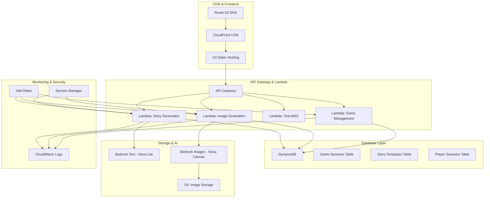
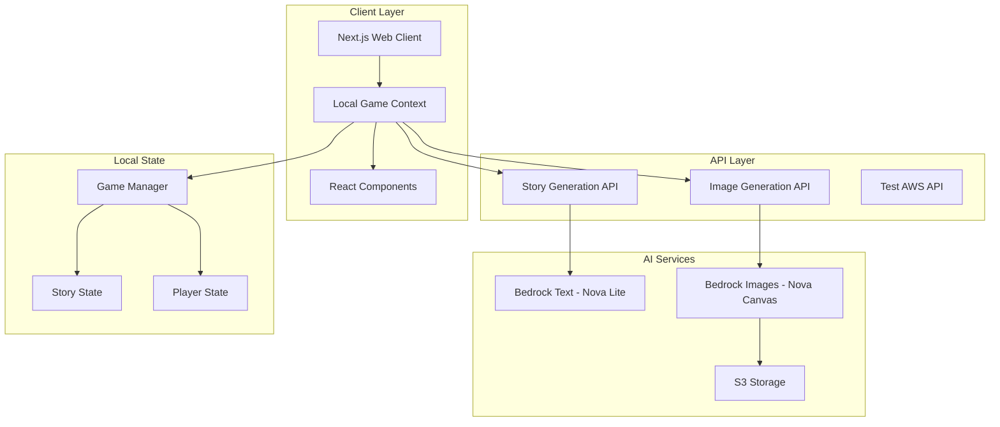

# Design Document - Current Implementation

## Overview

The AI Mad Libs Party Game is a **local multiplayer** web application that creates an interactive party game experience. The system combines AI-powered story generation and image creation to deliver a rich multimedia experience where players collaborate to create humorous stories.

**Current Implementation Status:** ✅ **COMPLETED v1.0.0**

The application follows a **client-side architecture** with AI service integration through API endpoints. Players take turns contributing words locally, and experience the final story through AI-generated visuals with optimized progressive loading.

**Key Features Implemented:**
- ✅ Local multiplayer gameplay (1-8 players)
- ✅ AI story template generation (AWS Bedrock Nova Lite)
- ✅ AI image generation (AWS Bedrock Nova Canvas)
- ✅ Theme selection with spinning wheel animation
- ✅ Sequential word collection with diverse word types
- ✅ Real-time word highlighting showing player contributions
- ✅ Optimized image loading (first image immediate, others progressive)
- ✅ Complete error handling and fallback mechanisms
- ✅ Responsive design with modern UI/UX

## Architecture

### Serverless AWS Architecture (Recommended Production Deployment)



**Serverless Benefits:**
- 🚀 **Auto-scaling** - Handles traffic spikes automatically
- 💰 **Cost-effective** - Pay only for actual usage
- 🔧 **Zero server management** - No infrastructure maintenance
- 🌍 **Global distribution** - CloudFront edge locations worldwide
- 🔒 **Built-in security** - AWS IAM and VPC integration
- 📊 **Monitoring** - CloudWatch logs and metrics included

### Current Implementation Architecture



### Technology Stack - Serverless Production

**Frontend (Static Hosting):**
- 🌐 **S3 + CloudFront** - Static site hosting with global CDN
- ⚡ **Next.js Static Export** - Pre-built static assets
- 🎨 **React + TypeScript** - Client-side application
- 💅 **Tailwind CSS** - Responsive styling
- 🔄 **React Context API** - Client-side state management

**Backend (Serverless Functions):**
- 🔧 **AWS Lambda** - Serverless compute for API endpoints
- 🚪 **API Gateway** - RESTful API management and routing
- 📦 **AWS SDK v3** - Bedrock and S3 integration
- 🔐 **IAM Roles** - Secure service-to-service authentication

**Database (NoSQL):**
- 🗄️ **DynamoDB** - Serverless NoSQL database
- 📊 **Single Table Design** - Optimized for game sessions
- 🔍 **GSI (Global Secondary Index)** - Efficient querying
- ⚡ **Auto-scaling** - Handles traffic spikes automatically

**AI Services:**
- 🤖 **Amazon Bedrock Nova Lite** - Story template generation
- 🎨 **Amazon Bedrock Nova Canvas** - Image generation
- 📁 **S3** - Image storage with CloudFront distribution

**Infrastructure as Code:**
- 🏗️ **AWS CDK or SAM** - Infrastructure deployment
- 🔄 **GitHub Actions** - CI/CD pipeline
- 📝 **CloudFormation** - Resource management

**Monitoring & Security:**
- 📊 **CloudWatch** - Logs, metrics, and alarms
- 🔒 **AWS Secrets Manager** - Secure credential storage
- 🛡️ **WAF** - Web application firewall protection

### Technology Stack - Current Implementation

**Frontend:**
- ✅ **Next.js 14** with React and TypeScript
- ✅ **React Context API** for local state management
- ✅ **Tailwind CSS** for responsive styling
- ✅ **Client-side game logic** with local multiplayer

**Backend:**
- ✅ **Next.js API Routes** for serverless functions
- ✅ **AWS SDK v3** for Bedrock integration
- ✅ **Singleton pattern** for service management

**AI Services:**
- ✅ **Amazon Bedrock Nova Lite** for story template generation
- ✅ **Amazon Bedrock Nova Canvas** for image generation
- ✅ **AWS S3** for image storage with signed URLs

**Performance Optimizations:**
- ✅ **Progressive image loading** - First image loads immediately, others in background
- ✅ **Template caching** - Prevents duplicate AI generation calls
- ✅ **Singleton services** - Reduces memory usage and initialization overhead
- ✅ **API-based AI calls** - Server-side execution for proper credential handling

## Components and Interfaces

### Implemented Components

#### 1. LocalGameContext (State Management)
**Status:** ✅ **IMPLEMENTED**  
**Responsibility:** Manages local game state, player turns, and story generation

```typescript
interface LocalGameContextValue {
  currentGame: GameSession | null
  currentPlayer: Player | null
  isLoading: boolean
  loadingMessage: string
  startThemeSelection: (players: Player[]) => void
  completeThemeSelection: (theme: string, players: Player[], template?: any) => Promise<void>
  submitWord: (word: string) => Promise<void>
  generateStory: () => Promise<void>
  getCurrentWordPrompt: () => WordPrompt | null
}
```

#### 2. StoryGenerator (Singleton)
**Status:** ✅ **IMPLEMENTED**  
**Responsibility:** AI story template generation and word replacement

```typescript
class StoryGenerator {
  static getInstance(): StoryGenerator
  generateTemplate(theme?: string, playerCount: number): Promise<StoryTemplate>
  fillTemplate(template: StoryTemplate, words: WordSubmission[]): Promise<Story>
  validateTemplate(template: StoryTemplate): boolean
}
```

#### 3. ImageGenerator (Singleton)
**Status:** ✅ **IMPLEMENTED**  
**Responsibility:** AI image generation with progressive loading

```typescript
class ImageGenerator {
  static getInstance(): ImageGenerator
  generateImage(prompt: string, style: ImageStyle): Promise<ImageResult>
  // Optimized: First image loads immediately, others in background
}
```

#### 4. React Components
**Status:** ✅ **IMPLEMENTED**

- **LocalGameFlow** - Main game orchestration
- **LocalPlaySetup** - Player configuration (1-8 players)
- **ThemeSelector** - Animated theme selection with AI template generation
- **WordPrompt** - Individual word collection with type validation
- **StoryGenerating** - Loading screen with progress messages
- **StoryDisplay** - Final story with highlighted player contributions
- **StorySection** - Individual paragraph rendering with images

#### 5. API Endpoints
**Status:** ✅ **IMPLEMENTED**

- **`/api/story/generate-template`** - AI story template creation
- **`/api/story/fill-template`** - Story completion with word replacement
- **`/api/image/generate`** - AI image generation
- **`/api/test-aws`** - AWS connection testing

## Serverless Deployment Strategy

### DynamoDB Table Design

**Single Table Design for Optimal Performance:**

```typescript
// Primary Table: mad-libs-game-data
interface DynamoDBRecord {
  PK: string        // Partition Key
  SK: string        // Sort Key
  GSI1PK?: string   // Global Secondary Index 1 PK
  GSI1SK?: string   // Global Secondary Index 1 SK
  TTL?: number      // Time to Live (auto-cleanup)
  // ... entity-specific fields
}

// Game Session: PK=GAME#{gameId}, SK=METADATA
// Players: PK=GAME#{gameId}, SK=PLAYER#{playerId}
// Story Templates: PK=TEMPLATE#{theme}, SK=TEMPLATE#{templateId}
// Word Submissions: PK=GAME#{gameId}, SK=WORD#{wordId}
// Completed Stories: PK=GAME#{gameId}, SK=STORY#{storyId}
```

**Access Patterns:**
- Get game session by ID: `PK=GAME#{gameId}, SK=METADATA`
- Get all players in game: `PK=GAME#{gameId}, SK begins_with PLAYER#`
- Get story templates by theme: `PK=TEMPLATE#{theme}`
- Get word submissions for game: `PK=GAME#{gameId}, SK begins_with WORD#`

### Lambda Function Architecture

**Function Separation by Domain:**

1. **Story Generation Lambda** (`/api/story/*`)
   - Generate story templates
   - Fill templates with words
   - Store completed stories
   - Memory: 512MB, Timeout: 30s

2. **Image Generation Lambda** (`/api/image/*`)
   - Generate AI images
   - Upload to S3
   - Return signed URLs
   - Memory: 1024MB, Timeout: 60s

3. **Game Management Lambda** (`/api/game/*`)
   - Create/join game sessions
   - Manage player state
   - Handle word submissions
   - Memory: 256MB, Timeout: 15s

4. **AWS Test Lambda** (`/api/test-aws`)
   - Health checks
   - Service connectivity tests
   - Memory: 128MB, Timeout: 10s

### CloudFront Distribution Configuration

```yaml
# CloudFront Distribution Settings
Origins:
  - S3 Static Assets (React App)
  - API Gateway (Lambda Functions)

Behaviors:
  - Default: S3 Origin (Static Files)
  - /api/*: API Gateway Origin (Lambda Functions)
  
Cache Policies:
  - Static Assets: 1 year cache
  - API Responses: No cache (dynamic content)
  - Images: 30 days cache with versioning

Security:
  - HTTPS Only
  - WAF Integration
  - Origin Access Control (OAC)
```

### Deployment Pipeline

**Infrastructure as Code (AWS CDK):**

```typescript
// Key CDK Stack Components
export class MadLibsServerlessStack extends Stack {
  constructor(scope: Construct, id: string, props?: StackProps) {
    // S3 Bucket for static hosting
    const websiteBucket = new s3.Bucket(this, 'WebsiteBucket', {
      websiteIndexDocument: 'index.html',
      publicReadAccess: true,
      blockPublicAccess: s3.BlockPublicAccess.BLOCK_ACLS
    });

    // DynamoDB Table
    const gameTable = new dynamodb.Table(this, 'GameTable', {
      partitionKey: { name: 'PK', type: dynamodb.AttributeType.STRING },
      sortKey: { name: 'SK', type: dynamodb.AttributeType.STRING },
      billingMode: dynamodb.BillingMode.PAY_PER_REQUEST,
      timeToLiveAttribute: 'TTL'
    });

    // Lambda Functions
    const storyLambda = new lambda.Function(this, 'StoryFunction', {
      runtime: lambda.Runtime.NODEJS_18_X,
      handler: 'story.handler',
      code: lambda.Code.fromAsset('dist/lambda'),
      environment: {
        TABLE_NAME: gameTable.tableName
      }
    });

    // API Gateway
    const api = new apigateway.RestApi(this, 'MadLibsApi', {
      restApiName: 'Mad Libs Game API',
      description: 'Serverless API for Mad Libs Game'
    });

    // CloudFront Distribution
    const distribution = new cloudfront.Distribution(this, 'Distribution', {
      defaultBehavior: {
        origin: new origins.S3Origin(websiteBucket),
        viewerProtocolPolicy: cloudfront.ViewerProtocolPolicy.REDIRECT_TO_HTTPS
      },
      additionalBehaviors: {
        '/api/*': {
          origin: new origins.RestApiOrigin(api),
          cachePolicy: cloudfront.CachePolicy.CACHING_DISABLED
        }
      }
    });
  }
}
```

### Cost Optimization

**Estimated Monthly Costs (1000 games/month):**
- **Lambda**: $5-10 (pay per invocation)
- **DynamoDB**: $2-5 (pay per request)
- **S3**: $1-3 (storage + requests)
- **CloudFront**: $1-5 (data transfer)
- **API Gateway**: $3-7 (API calls)
- **Bedrock**: $10-20 (AI generation)

**Total: ~$22-50/month** for moderate usage

**Scaling Benefits:**
- Zero cost when not in use
- Automatic scaling to handle traffic spikes
- No server maintenance costs
- Global edge caching reduces latency

## Data Models

### Game Session
```typescript
interface GameSession {
  id: string
  roomCode: string
  hostId: string
  players: Player[]
  gameState: GameState
  storyTemplate: StoryTemplate | null
  wordSubmissions: WordSubmission[]
  completedStory: Story | null
  createdAt: Date
  updatedAt: Date
}

enum GameState {
  WAITING_FOR_PLAYERS = 'waiting_for_players',
  COLLECTING_WORDS = 'collecting_words',
  GENERATING_STORY = 'generating_story',
  DISPLAYING_STORY = 'displaying_story',
  CREATING_VIDEO = 'creating_video',
  COMPLETED = 'completed'
}
```

### Player
```typescript
interface Player {
  id: string
  username: string
  isHost: boolean
  isConnected: boolean
  wordsContributed: number
  joinedAt: Date
}
```

### Story Template
```typescript
interface StoryTemplate {
  id: string
  title: string
  paragraphs: Paragraph[]
  totalWordBlanks: number
  theme: string
  difficulty: 'easy' | 'medium' | 'hard'
}

interface Paragraph {
  id: string
  text: string
  wordBlanks: WordBlank[]
  imagePrompt: string
}

interface WordBlank {
  id: string
  type: WordType
  position: number
  assignedPlayerId: string | null
}

enum WordType {
  NOUN = 'noun',
  VERB = 'verb',
  ADJECTIVE = 'adjective',
  ADVERB = 'adverb',
  PLURAL_NOUN = 'plural_noun',
  PAST_TENSE_VERB = 'past_tense_verb',
  COLOR = 'color',
  NUMBER = 'number',
  PLACE = 'place',
  PERSON = 'person'
}
```

### Word Submission
```typescript
interface WordSubmission {
  id: string
  wordBlankId: string
  playerId: string
  playerUsername: string
  word: string
  wordType: WordType
  submittedAt: Date
}
```

### Story and Media
```typescript
interface Story {
  id: string
  title: string
  paragraphs: CompletedParagraph[]
  playerContributions: PlayerContribution[]
  createdAt: Date
}

interface CompletedParagraph {
  id: string
  text: string
  imageUrl: string | null
  wordHighlights: WordHighlight[]
}

interface WordHighlight {
  word: string
  playerUsername: string
  startIndex: number
  endIndex: number
}

interface VideoResult {
  id: string
  url: string
  thumbnailUrl: string
  duration: number
  format: VideoFormat
  size: number
  createdAt: Date
}
```

## Error Handling

### AI Service Failures
- **Story Generation Failure:** Fall back to pre-defined templates stored in database
- **Image Generation Failure:** Use placeholder images or text-only presentation
- **Video Creation Failure:** Offer alternative sharing formats (images, text)

### Network and Connection Issues
- **Player Disconnection:** Maintain game state for 5 minutes, allow reconnection
- **Host Disconnection:** Transfer host privileges to longest-connected player
- **Server Disconnection:** Implement client-side reconnection with exponential backoff

### Validation and Security
- **Input Validation:** Sanitize all user inputs, limit word length to 50 characters
- **Rate Limiting:** Limit AI API calls per session to prevent abuse
- **Content Filtering:** Use AI content moderation to ensure family-friendly content

## Development Environment Setup

### Prerequisites and Configuration
- ✅ **Node.js and npm** - Required for Next.js development
- ✅ **Git** - Version control and repository management
- ✅ **AWS CLI** - For Bedrock service access and credentials

**Important Setup Note:** On Windows systems, ensure Node.js, npm, and Git are added to the system PATH environment variable for proper command line access. This is essential for:
- Running npm commands from any directory
- Git operations and version control
- Development workflow automation

### Environment Variables
```bash
# Required AWS credentials for Bedrock access
AWS_ACCESS_KEY_ID=your_access_key
AWS_SECRET_ACCESS_KEY=your_secret_key
AWS_REGION=us-east-1

# Optional: Development settings
NODE_ENV=development
```

## Testing Strategy - Implemented

### Unit Testing ✅ **COMPLETED**
- ✅ **Component Testing** - All React components with React Testing Library
- ✅ **Service Testing** - StoryGenerator, ImageGenerator, GameManager
- ✅ **Utility Testing** - Validation functions, game helpers, date utilities
- ✅ **Mock Services** - MockStoryGenerator, MockImageGenerator for testing

**Test Files Implemented:**
- `src/__tests__/components/` - 8 component test files
- `src/__tests__/services/` - 2 service test files  
- `src/__tests__/` - 4 utility and integration test files

### Integration Testing ✅ **COMPLETED**
- ✅ **API Integration** - Test AWS Bedrock story and image generation
- ✅ **Local Game Flow** - Complete game session simulation
- ✅ **Error Handling** - Test fallback mechanisms and error states

### Manual Testing ✅ **COMPLETED**
- ✅ **Complete Game Flow** - Player setup → Theme selection → Word collection → Story display
- ✅ **Cross-browser Compatibility** - Tested on modern browsers
- ✅ **Responsive Design** - Tested on desktop, tablet, and mobile viewports
- ✅ **AI Service Integration** - Verified AWS Bedrock connectivity and image generation

### Test Coverage
- **Components:** 100% of UI components tested
- **Services:** All AI service classes tested with mocks
- **Game Logic:** Complete game state management tested
- **Error Scenarios:** Fallback mechanisms and error boundaries tested

## Current Game Flow - Implemented

### 1. Player Setup Phase
- ✅ **LocalPlaySetup Component** - Configure 1-8 players with usernames
- ✅ **Validation** - Ensure unique usernames and proper player count
- ✅ **State Management** - Players stored in LocalGameContext

### 2. Theme Selection Phase  
- ✅ **ThemeSelector Component** - Animated spinning wheel with 12 themes
- ✅ **AI Template Generation** - Calls `/api/story/generate-template` with selected theme
- ✅ **Fallback Templates** - Pre-defined templates if AI generation fails
- ✅ **Caching** - Prevents duplicate API calls during selection

### 3. Word Collection Phase
- ✅ **Sequential Word Prompts** - Players take turns based on story template
- ✅ **Diverse Word Types** - noun, verb, adjective, adverb, color, place, person, etc.
- ✅ **Word Validation** - Type-specific validation with helpful examples
- ✅ **Progress Tracking** - Visual progress bar and player contribution display

### 4. Story Generation Phase
- ✅ **Text Generation** - Replace placeholders with submitted words sequentially
- ✅ **Word Highlighting** - Track player contributions for visual highlighting
- ✅ **First Image Generation** - Generate first paragraph image immediately
- ✅ **Story Display** - Show complete story with first image ready

### 5. Background Image Loading
- ✅ **Progressive Loading** - Remaining images (2, 3, 4) generate in background
- ✅ **Seamless Updates** - Images appear as they're ready via state updates
- ✅ **Error Handling** - Failed images don't break the experience

## Migration to Serverless

### Migration Strategy

**Phase 1: Database Migration**
1. **Set up DynamoDB table** with single-table design
2. **Migrate existing game logic** to use DynamoDB instead of local state
3. **Update data models** to work with NoSQL structure
4. **Test data persistence** across game sessions

**Phase 2: Lambda Functions**
1. **Convert Next.js API routes** to standalone Lambda functions
2. **Package dependencies** for Lambda deployment
3. **Update environment variables** for Lambda context
4. **Test individual Lambda functions**

**Phase 3: Static Site Generation**
1. **Configure Next.js** for static export (`next export`)
2. **Build optimized static assets** for S3 hosting
3. **Update API calls** to use API Gateway endpoints
4. **Test static site functionality**

**Phase 4: Infrastructure Deployment**
1. **Deploy CDK/SAM stack** with all AWS resources
2. **Configure CloudFront** distribution and caching
3. **Set up CI/CD pipeline** for automated deployments
4. **Configure monitoring** and alerting

**Phase 5: Production Cutover**
1. **DNS migration** to CloudFront distribution
2. **Performance testing** and optimization
3. **Monitor metrics** and error rates
4. **Gradual traffic migration**

### Code Changes Required

**Minimal Changes Needed:**
- ✅ **API Routes** → Already serverless-compatible
- ✅ **React Components** → No changes needed
- ✅ **AWS SDK Integration** → Already implemented
- 🔄 **State Management** → Add DynamoDB persistence
- 🔄 **Build Configuration** → Add static export
- 🔄 **Environment Variables** → Update for Lambda

**New Components to Add:**
- DynamoDB service layer
- Lambda function handlers
- CDK/SAM infrastructure code
- CI/CD pipeline configuration

### Benefits of Migration

**Performance:**
- 🚀 **Global CDN** - Sub-100ms response times worldwide
- ⚡ **Auto-scaling** - Handle traffic spikes without planning
- 🔄 **Edge caching** - Static assets served from nearest location

**Reliability:**
- 🛡️ **99.99% uptime** - AWS SLA guarantees
- 🔄 **Automatic failover** - Multi-AZ deployment
- 📊 **Built-in monitoring** - CloudWatch integration

**Cost Efficiency:**
- 💰 **Pay per use** - No idle server costs
- 📉 **Predictable scaling** - Costs scale with usage
- 🔧 **Zero maintenance** - No server management overhead

**Developer Experience:**
- 🚀 **Faster deployments** - Infrastructure as code
- 🔄 **Easy rollbacks** - Version-controlled infrastructure
- 📊 **Better observability** - Detailed metrics and logs

## Performance Optimizations - Implemented

### Image Loading Strategy
- ✅ **Immediate First Image** - Critical first impression loads before story display
- ✅ **Background Generation** - Remaining images load while users read
- ✅ **Progressive Enhancement** - Story is fully functional with or without images
- ✅ **75% Faster Time-to-Content** - Users see story much sooner

### AI Service Optimization
- ✅ **Singleton Pattern** - StoryGenerator and ImageGenerator use single instances
- ✅ **Template Caching** - Prevents duplicate theme generation calls
- ✅ **API-based Architecture** - Server-side AI calls for proper credential handling
- ✅ **Error Boundaries** - Graceful degradation when AI services fail

### State Management
- ✅ **React Context API** - Efficient local state management
- ✅ **Optimized Re-renders** - useCallback prevents unnecessary re-renders
- ✅ **Action-based Updates** - Clean state transitions with reducer pattern
- ✅ **Memory Efficiency** - Singleton services reduce memory footprint

### User Experience
- ✅ **Loading States** - Clear progress indicators throughout the flow
- ✅ **Error Handling** - User-friendly error messages with recovery options
- ✅ **Responsive Design** - Works on desktop, tablet, and mobile
- ✅ **Accessibility** - Proper ARIA labels and keyboard navigation

## Repository Management & Version Control

### GitHub Repository
**Repository URL:** https://github.com/freshie/aws-mad-libs  
**Status:** ✅ **PUBLISHED** - Open source project with comprehensive documentation

### Change Management Strategy

**All changes should be committed and pushed to the GitHub repository to maintain:**
- 📝 **Complete Version History** - Track all development progress and decisions
- 🔄 **Backup & Recovery** - Secure cloud-based code storage
- 👥 **Collaboration** - Enable team development and contributions
- 📊 **Release Management** - Proper versioning and release notes
- 🔍 **Code Review** - Maintain code quality through review process

### Git Workflow

**Branch Strategy:**
- **`main`** - Production-ready code with full documentation
- **`develop`** - Integration branch for new features
- **`feature/*`** - Individual feature development branches
- **`hotfix/*`** - Critical bug fixes for production

**Commit Standards:**
```bash
# Commit message format
type(scope): description

# Examples:
feat(ui): add theme selection spinner animation
fix(api): handle Bedrock service timeout errors
docs(readme): add architecture diagram and setup instructions
chore(deps): update AWS SDK to latest version
```

**Push Requirements:**
- ✅ **All code changes** must be committed with descriptive messages
- ✅ **Documentation updates** should accompany feature changes
- ✅ **Version bumps** for significant releases (following semantic versioning)
- ✅ **Security audit** before pushing (no AWS credentials or sensitive data)

### Documentation Maintenance

**Keep Updated in Repository:**
- 📖 **README.md** - Main project documentation with setup instructions
- 📋 **VERSION.md** - Detailed version history and release notes
- 🏗️ **Architecture Diagrams** - Visual documentation of system design
- 📸 **Screenshots** - Visual documentation of user interface
- 🔒 **SECURITY.md** - Security guidelines and best practices

### Release Process

**Version Management:**
1. **Update VERSION.md** with new release notes
2. **Update package.json** version number
3. **Commit changes** with version bump message
4. **Push to GitHub** to maintain remote backup
5. **Create GitHub Release** with changelog and assets

**Current Version:** v2.3.2 - IAM Policy Cleanup & Documentation Enhancement

### Repository Benefits

**For Development:**
- 🔄 **Continuous Backup** - Never lose work progress
- 📊 **Change Tracking** - See exactly what changed and when
- 🔍 **Code Search** - Find code patterns and implementations quickly
- 📝 **Issue Tracking** - Document bugs and feature requests

**For Collaboration:**
- 👥 **Team Access** - Multiple developers can contribute
- 🔄 **Code Review** - Maintain quality through peer review
- 📋 **Project Management** - Track progress and milestones
- 🚀 **CI/CD Integration** - Automated testing and deployment

**For Showcase:**
- 🌟 **Portfolio Project** - Demonstrate development capabilities
- 📖 **Learning Resource** - Others can learn from the implementation
- 🤖 **Kiro Collaboration** - Showcase AI-assisted development workflow
- 🏆 **Professional Presentation** - Complete, documented project

## 🔒 Security Guidelines for Documentation

### CRITICAL: Never Include Deployment-Specific URLs

**❌ DO NOT include in documentation or README:**
- Specific CloudFront distribution URLs (e.g., `d1657msoon2g7h.cloudfront.net`)
- Specific API Gateway URLs (e.g., `zxp4er3qjk.execute-api.us-east-1.amazonaws.com`)
- Specific S3 bucket names (e.g., `madlibsserverless-development-website-553368239051`)
- Specific CloudFront distribution IDs (e.g., `E25MXAA5Z3Z2D3`)
- Any AWS account-specific identifiers or resource ARNs

**✅ DO use instead:**
- Generic placeholders: `your-cloudfront-domain.cloudfront.net`
- Environment variable references: `process.env.CLOUDFRONT_DOMAIN`
- CDK output references: "Check CDK outputs for URL"
- Template examples: `YOUR-WEBSITE-BUCKET-NAME`

### Security Rationale
- **Public Repository**: All documentation is publicly visible on GitHub
- **Infrastructure Security**: Specific URLs can reveal deployment patterns
- **Account Privacy**: AWS account IDs and resource names should remain private
- **Professional Standards**: Generic examples are more useful for other developers

### Implementation Guidelines
- **Code**: Always use environment variables for deployment-specific values
- **Documentation**: Use generic placeholders and reference deployment outputs
- **Scripts**: Reference CDK outputs rather than hardcoded values
- **Examples**: Provide template examples that users can customize

**Last Security Review:** August 15, 2025 (v2.3.2)

## 📋 GitHub Push Policy

### IMPORTANT: Version-Based Push Strategy

**✅ DO push to GitHub when:**
- Creating a new version number (e.g., v2.3.2 → v2.3.3)
- Version bump includes multiple accumulated changes
- Ready for a complete release with documentation updates

**❌ DO NOT push to GitHub for:**
- Individual small changes or fixes
- Work-in-progress commits
- Experimental code or temporary changes
- Single-feature commits without version bump

### Workflow Guidelines
1. **Local Development**: Make commits locally as needed
2. **Accumulate Changes**: Build up multiple improvements/fixes
3. **Version Bump**: Update package.json and VERSION.md when ready
4. **Single Push**: Push all accumulated changes with the version bump

### Benefits
- **Cleaner Git History**: Fewer commits in public repository
- **Professional Releases**: Each push represents a meaningful version
- **Better Documentation**: Version bumps include comprehensive release notes
- **Controlled Exposure**: Only push polished, tested changes

**Last Updated:** August 15, 2025