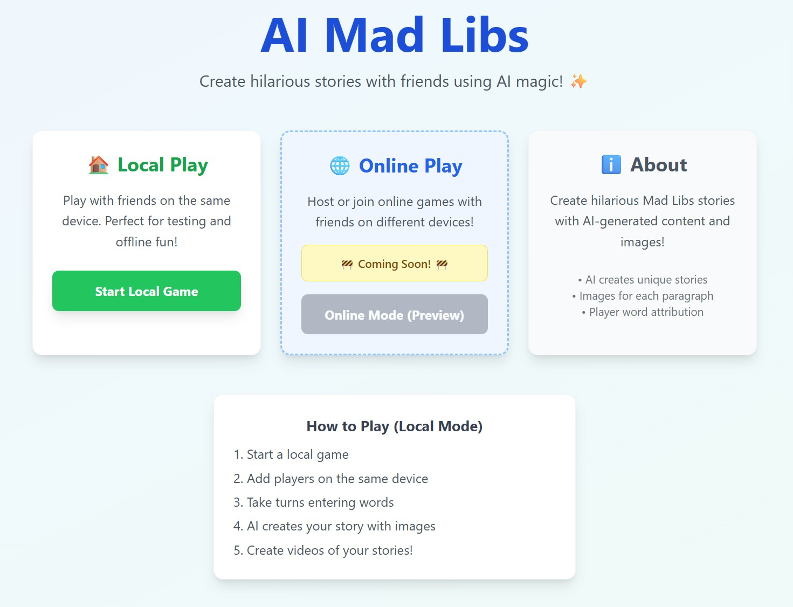
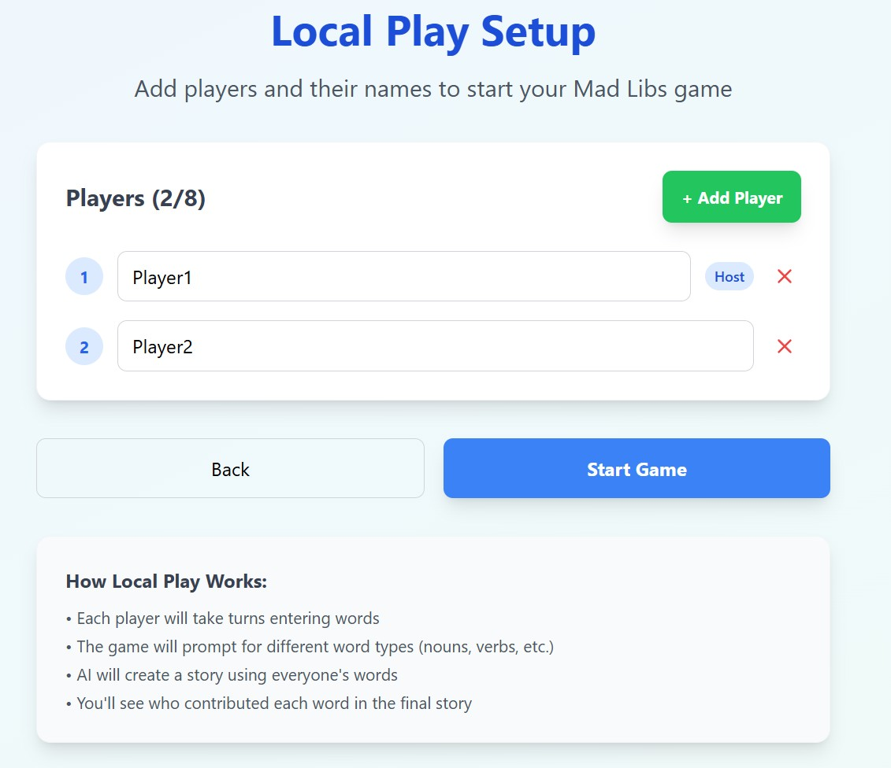
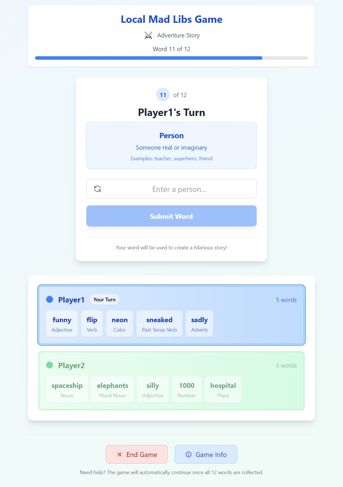
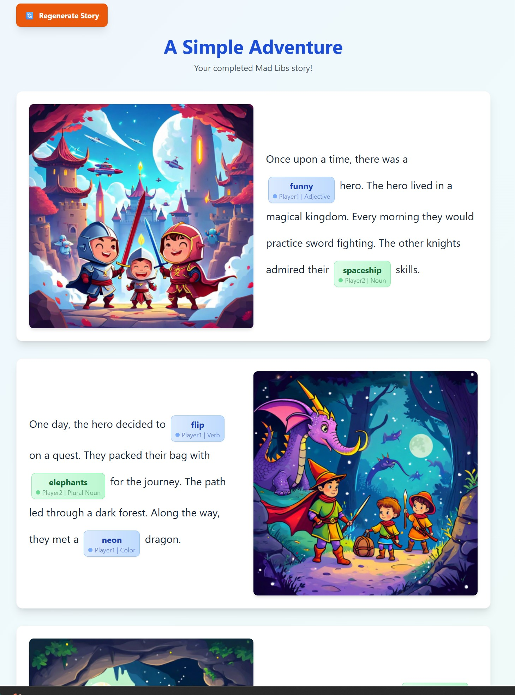
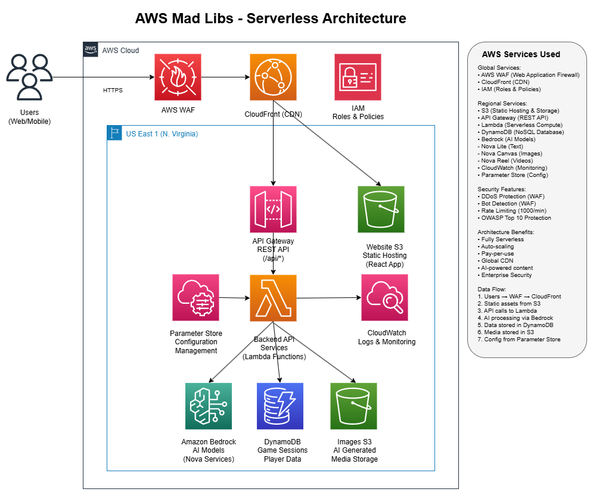

# AWS Mad Libs Game

A serverless Mad Libs game that creates hilarious stories using AI-generated content, images, and videos. Built with Next.js, AWS CDK, and AWS Bedrock AI services.

## 🤖 Built with Kiro AI

This project showcases what it's like to **vibe code with Kiro** - an AI-powered development experience that transforms how we build software. From initial concept to production deployment, this entire serverless application was developed through collaborative sessions with Kiro, demonstrating:

- **Rapid Prototyping**: From idea to working MVP in hours, not days
- **Architecture Design**: AI-assisted decisions on serverless patterns and AWS services
- **Code Generation**: Intelligent code completion and full-feature implementation
- **Documentation**: Auto-generated docs, diagrams, and comprehensive README
- **Deployment**: Automated CDK infrastructure and deployment scripts
- **Debugging**: AI-powered troubleshooting and optimization suggestions

**The Result**: A production-ready, fully-documented serverless application with professional architecture, security best practices, and polished user experience - all achieved through natural conversation and collaborative coding with AI.

*Want to experience this development flow yourself? Try Kiro and see how AI can accelerate your next project.*

## Features

- 🎮 **Local Multiplayer**: Support for 1-8 players on the same device
- 🤖 **AI-Generated Stories**: Original Mad Libs templates created by Amazon Bedrock
- 🎨 **AI-Generated Images**: Visual content using Amazon Nova Canvas
- 🎬 **Video Creation**: Shareable videos using Amazon Nova Reel
- 📱 **Mobile Friendly**: Responsive design optimized for all devices
- ⚡ **Serverless**: Fully serverless architecture with AWS Lambda
- 🔒 **Secure**: IAM-based security with encrypted storage

## Screenshots

### Homepage

*Clean, modern interface with easy navigation to start playing Mad Libs*

### Game Setup

*Simple setup screen to configure your Mad Libs game experience*

### Game Management

*Manage and select from different Mad Libs game templates*

### Final Story with AI-Generated Images

*Completed Mad Libs story with beautiful AI-generated images from Amazon Nova Canvas*

## Tech Stack

### Frontend
- **Next.js 14** with App Router and static export
- **TypeScript** for type safety
- **Tailwind CSS** for styling
- **Hosted on S3** with CloudFront CDN

### Backend (Serverless)
- **AWS Lambda** functions for all business logic
- **API Gateway** for RESTful endpoints
- **DynamoDB** for game data storage
- **S3** for static hosting and media storage

### AI & Media Services
- **Amazon Bedrock Nova Lite** for story generation
- **Amazon Nova Canvas** for image generation
- **Amazon Nova Reel** for video generation
- **Amazon S3** for media storage and static hosting
- **Amazon CloudFront** for global content delivery

## Architecture



The application follows a fully serverless architecture pattern:

### Core Infrastructure
- **CloudFront Distribution**: Global CDN for static assets and API caching
- **S3 Buckets**: Static website hosting and AI-generated media storage
- **API Gateway**: RESTful endpoints with CORS support and throttling
- **Lambda Functions**: Serverless compute with automatic scaling
- **DynamoDB**: NoSQL database with single-table design and GSI indexes

### Lambda Functions
- **Story Generation**: Creates Mad Libs templates using Bedrock Nova Lite
- **Story Fill**: Fills templates with player words and generates final stories
- **Image Generation**: Creates images using Amazon Nova Canvas
- **Video Generation**: Produces videos using Amazon Nova Reel
- **Test AWS**: Validates AWS service connectivity

### AI Services
- **Amazon Bedrock**: Foundation models for text and media generation
- **Nova Lite**: Fast text generation for stories and prompts
- **Nova Canvas**: High-quality image generation from text descriptions
- **Nova Reel**: Video generation combining images and text

## Getting Started

### Prerequisites
- **Node.js 18+** and npm
- **AWS Account** with Bedrock access enabled
- **AWS CLI** configured with appropriate permissions
- **CDK CLI** installed globally (`npm install -g aws-cdk`)

### Quick Setup

1. **Clone the repository**
```bash
git clone https://github.com/freshie/aws-mad-libs.git
cd aws-mad-libs
```

2. **Install dependencies**
```bash
npm install
cd lambda && npm install && cd ..
```

3. **Configure AWS credentials**
```bash
aws configure
# Enter your AWS Access Key ID, Secret Access Key, and region (us-east-1 recommended)
```

4. **Bootstrap CDK (first time only)**
```bash
npm run cdk:bootstrap
```

5. **Build and deploy the serverless stack**
```bash
# Build Lambda functions
npm run build:lambda

# Deploy infrastructure
npm run cdk:deploy
```

6. **Build and deploy the frontend**
```bash
# Build Next.js static site
npm run build

# Deploy to S3 (using actual deployed bucket name)
aws s3 sync out/ s3://madlibsserverless-development-website-553368239051 --delete

# Invalidate CloudFront cache (using actual distribution ID)
aws cloudfront create-invalidation --distribution-id E25MXAA5Z3Z2D3 --paths "/*"
```

**🌐 Live Application:** https://d1657msoon2g7h.cloudfront.net

### 🚀 Deployment Scripts
- `npm run deploy:serverless` - Full automated deployment
- `npm run cdk:deploy` - Deploy AWS infrastructure only
- `npm run cdk:destroy` - Remove all AWS resources
- `npm run check:deployment` - Verify deployment readiness

## Project Structure

```
├── src/                    # Next.js frontend application
│   ├── app/               # Next.js App Router pages
│   ├── components/        # React components
│   └── utils/            # Frontend utilities
├── lambda/                # AWS Lambda functions
│   ├── src/              # Lambda source code
│   │   ├── services/     # Business logic services
│   │   ├── types/        # TypeScript type definitions
│   │   └── utils/        # Lambda utilities
│   └── dist/             # Compiled Lambda code
├── cdk/                   # AWS CDK infrastructure code
├── docs/                  # Documentation and diagrams
└── scripts/              # Deployment and setup scripts
```

## API Endpoints

The serverless API provides the following endpoints:

- `POST /api/story/generate-template` - Generate a new Mad Libs template using Bedrock Nova Lite
- `POST /api/story/fill-template` - Fill template with player words and create complete story
- `POST /api/image/generate` - Generate images for story paragraphs using Nova Canvas
- `POST /api/video/generate` - Create shareable video content using Nova Reel
- `GET /api/test-aws` - Test AWS service connectivity and Bedrock access

**Live API Base URL:** `https://zxp4er3qjk.execute-api.us-east-1.amazonaws.com/prod/`

## Game Flow

1. **Player Setup**: Configure 1-8 players with unique usernames on the same device
2. **Theme Selection**: Choose from 12 different themes with spinning wheel animation
3. **Story Template Generation**: AI creates a Mad Libs template with blanks for the chosen theme
4. **Word Collection**: Players take turns providing words for each blank (noun, verb, adjective, etc.)
5. **Story Completion**: AI fills the template with player words, highlighting each player's contributions
6. **Image Generation**: AI creates visual content for each story paragraph using Nova Canvas
7. **Video Creation**: Combine story, images, and player credits into a shareable video using Nova Reel
8. **Sharing**: Download or share the completed story and media with all player contributions highlighted

## Development

### Local Development
```bash
# Start Next.js development server
npm run dev

# Build Lambda functions
npm run build:lambda

# Deploy changes to AWS
npm run cdk:deploy
```

### CDK Commands
```bash
# View infrastructure changes
npm run cdk:diff

# Synthesize CloudFormation templates
npm run cdk:synth

# List all stacks
npm run cdk:ls

# Watch for changes and auto-deploy
npm run cdk:watch
```

### Building
```bash
# Build frontend for production
npm run build

# Build Lambda functions
npm run build:lambda

# Clean Lambda build artifacts
npm run clean:lambda
```

## Contributing

1. Fork the repository
2. Create a feature branch
3. Make your changes
4. Add tests for new functionality
5. Submit a pull request

## License

MIT License - see LICENSE file for details