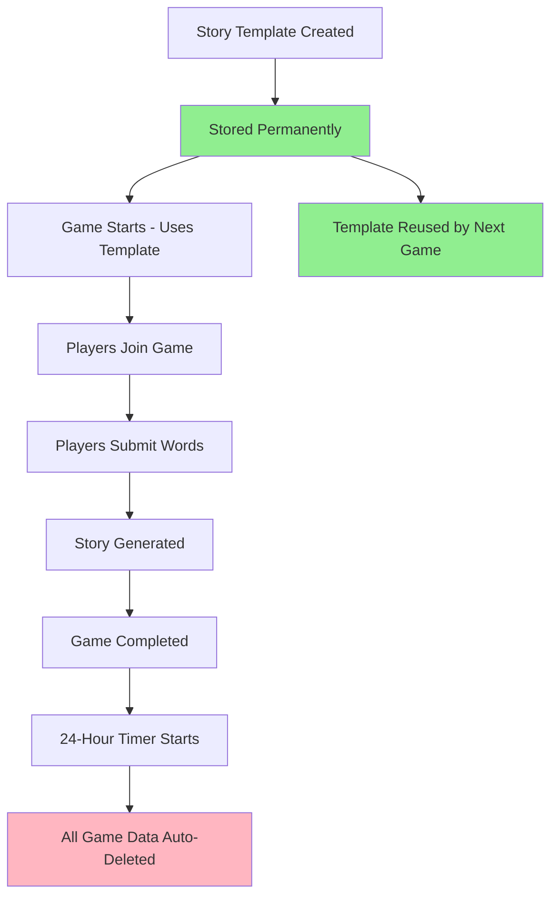

# Data Retention Policy - Mad Libs Game

## Overview

The Mad Libs game uses a two-tier data retention strategy to balance functionality with cost and privacy.

## Retention Tiers

### 🔒 **Permanent Storage (No TTL)**
**Story Templates** - The reusable story frameworks

```typescript
// These live forever and are reused across games
StoryTemplateRecord {
  PK: 'TEMPLATE#adventure',
  SK: 'TEMPLATE#template-001',
  Title: "The Great Adventure",
  Paragraphs: [
    {
      text: "Once upon a time, there was a {ADJECTIVE} {NOUN}...",
      wordBlanks: [
        { type: 'adjective', placeholder: '{ADJECTIVE}' },
        { type: 'noun', placeholder: '{NOUN}' }
      ]
    }
  ],
  TTL: undefined // ← NEVER EXPIRES
}
```

**Why Permanent?**
- ✅ **Reusability** - Same template used by thousands of games
- ✅ **Quality Control** - Curated templates don't get lost
- ✅ **Performance** - No need to regenerate with AI
- ✅ **Cost Efficiency** - Reduce Bedrock API calls

### ⏰ **24-Hour Storage (Auto-Delete)**
**Game Data** - Everything related to individual game sessions

```typescript
// Game Session - expires after 24 hours
GameSessionRecord {
  PK: 'GAME#game-123',
  SK: 'METADATA',
  RoomCode: 'ABC123',
  Players: [...],
  TTL: now + 24_hours // ← AUTO-DELETE
}

// Player Data - expires with game
PlayerRecord {
  PK: 'GAME#game-123',
  SK: 'PLAYER#alice',
  Username: 'Alice',
  WordsContributed: 3,
  TTL: now + 24_hours // ← AUTO-DELETE
}

// Word Submissions - expires with game
WordSubmissionRecord {
  PK: 'GAME#game-123',
  SK: 'WORD#word-456',
  Word: 'purple',
  PlayerUsername: 'Alice',
  TTL: now + 24_hours // ← AUTO-DELETE
}

// Completed Story - expires with game
CompletedStoryRecord {
  PK: 'GAME#game-123',
  SK: 'STORY#story-789',
  Title: "The Great Adventure",
  Paragraphs: [
    {
      text: "Once upon a time, there was a PURPLE ELEPHANT...",
      wordHighlights: [
        { word: 'PURPLE', playerUsername: 'Alice' }
      ]
    }
  ],
  TTL: now + 24_hours // ← AUTO-DELETE
}
```

**Why 24-Hour Deletion?**
- 💰 **Cost Control** - Prevents unbounded storage growth
- 🔒 **Privacy** - Player data automatically removed
- ⚡ **Performance** - Keeps table size manageable
- 📋 **Compliance** - Automatic data retention policy

## Data Flow Lifecycle



## Storage Breakdown

### What Gets Kept Forever
- Story templates with placeholders
- Theme categories and metadata
- System configuration
- Word type definitions

### What Gets Deleted After 24 Hours
- Game sessions and room codes
- Player usernames and contributions
- Individual word submissions
- Completed stories with player words
- Generated images and media
- Game statistics and metrics

## Benefits

### **Cost Optimization**
- Templates are small and reused → minimal permanent storage
- Game data is large but temporary → automatic cleanup
- No manual cleanup processes needed
- Predictable storage costs

### **Privacy Protection**
- Player data automatically removed
- No long-term tracking of individuals
- Compliant with data protection regulations
- Clean slate for each game session

### **Performance**
- Table size stays manageable
- Query performance remains consistent
- No need for manual archiving
- Automatic maintenance

### **User Experience**
- Templates improve over time
- Consistent game quality
- Fast game startup (templates cached)
- No storage limits for players

## Implementation Details

### TTL Configuration
```typescript
// In DynamoDB table creation
timeToLiveAttribute: 'TTL',

// In application code
const TTLHelpers = {
  // Templates never expire
  NO_TTL: undefined,
  
  // Game data expires after 24 hours
  GAME_SESSION_TTL: () => Math.floor(Date.now() / 1000) + (24 * 60 * 60),
  COMPLETED_STORY_TTL: () => Math.floor(Date.now() / 1000) + (24 * 60 * 60),
  WORD_SUBMISSION_TTL: () => Math.floor(Date.now() / 1000) + (24 * 60 * 60)
}
```

### Monitoring
- CloudWatch metrics for TTL deletions
- Alerts for unusual deletion patterns
- Storage size monitoring
- Cost tracking per data type

This retention policy ensures we keep the valuable reusable content while automatically cleaning up temporary game data for cost and privacy optimization!